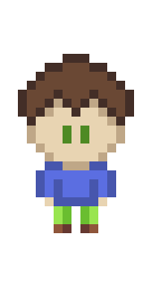

# Персонажи игры

## 1. Хиро Ледженд
  

**Возраст:** 12 лет

**Пол:** Мужской

**Умения:** 

**Описание:** _ГГ. Мальчик возраста 12 лет. Наслышавшись легенд о герое острова Дот, возомнил тоже стать героем. По характеру тщеславный, прямой-грубоватый, но очень добрый, изобретательный и безгранично храбрый (возможно даже слегка безрассуден в этом). Живёт в Литлтауне и ищет всё время приключения на свою голову._  

## 2. Нелли Чарм
_Подруга ГГ. Не понимает невероятного увлечения Хиро геройством, но без ума от его храбрости и бесстрашия в особо опасных ситуациях._  
## 3. Декстер Роуг
_Самозванный соперник ГГ. Хитрый, алчный, горделивый любитель чужого имущества, но в тоже завидующий и восхищающийся героем. Всё время старается подражать герою и тоже помогает окружающим, но из-за неискренности поступков, часто попадает впросак._  
## 4. Колобок Мистер Бредсон
_Некогда испечённый бабкой и дедом из низкокачественной муки, получил плохой характер и сбежал из дому. Из-за того, что во время побега был чуть не съеден крысами, стал необычайно агрессивным. Что в итоге и стало причиной съедения всех тех, кто встал на его пути.

